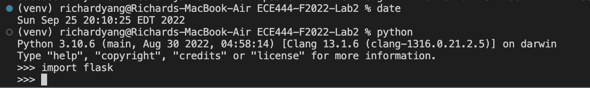
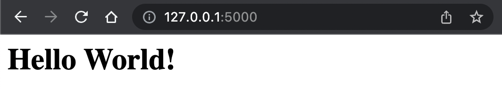
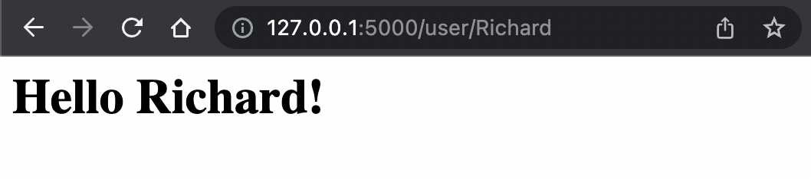
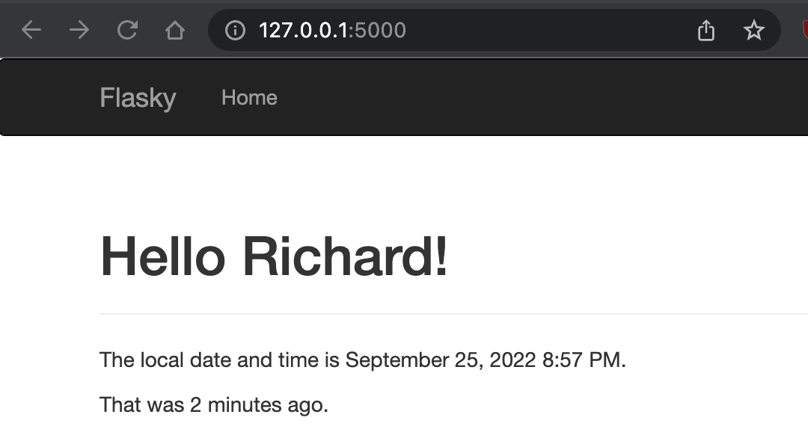
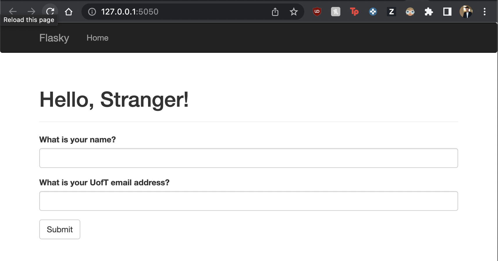
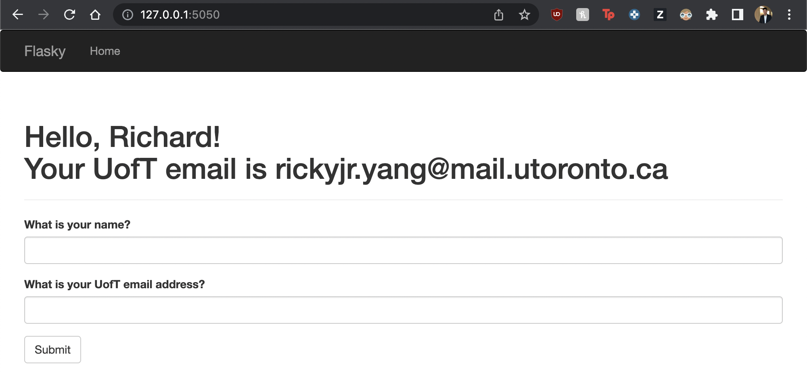
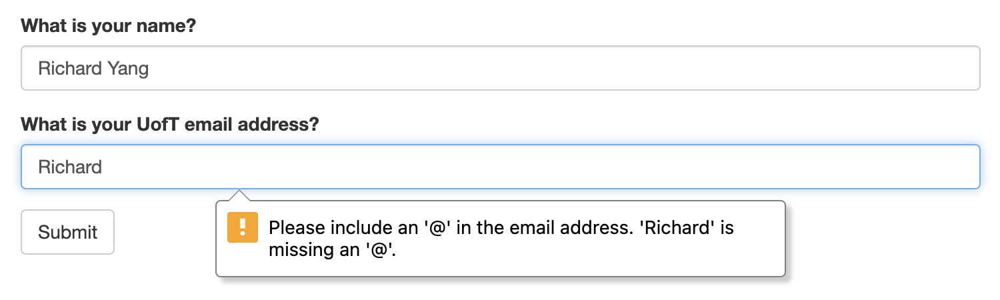
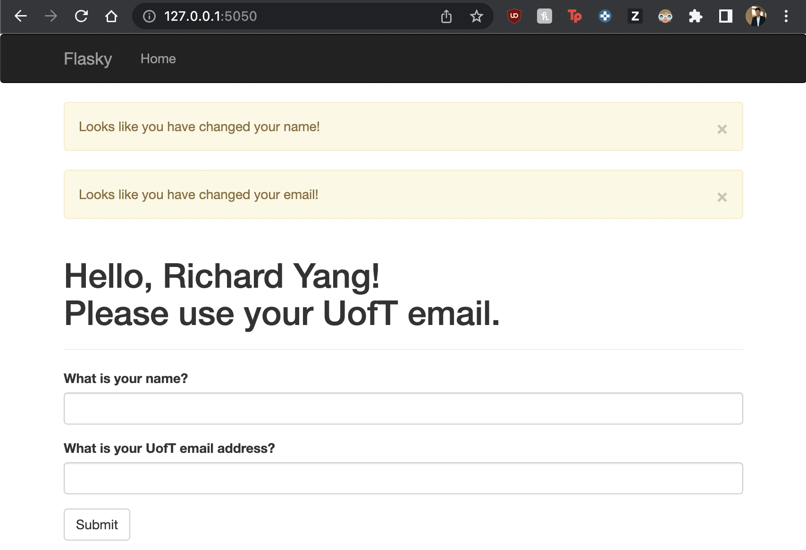

This repo is a clone of https://github.com/miguelgrinberg/flasky

Activity 1 - Installation

Activity 2 - Hello World & Hello User

Activity 3

Activity 4

Example 4.7 With Email Field

Results after form submission

Attempting submission of first and list name in 1st field and first name in the 2nd field.

Results of full name in the name field and a non-uoft email in the email field

